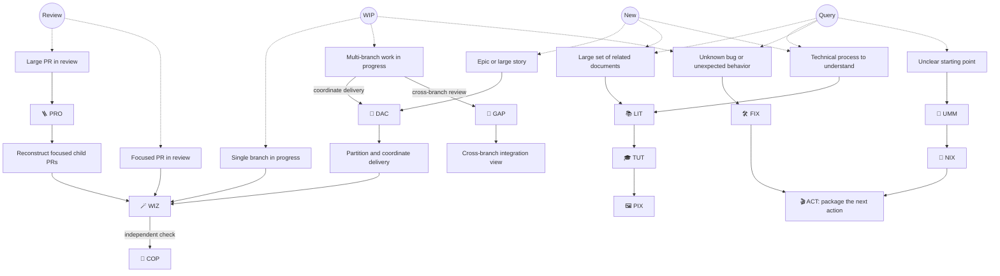
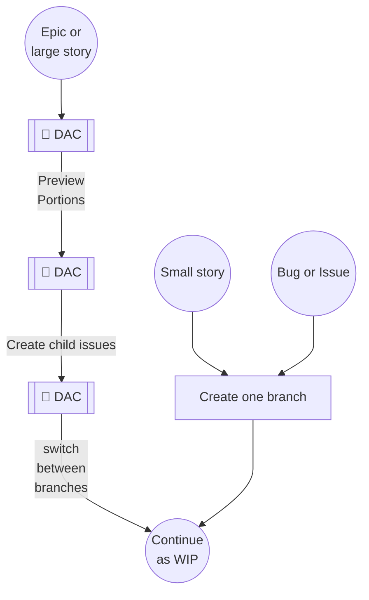
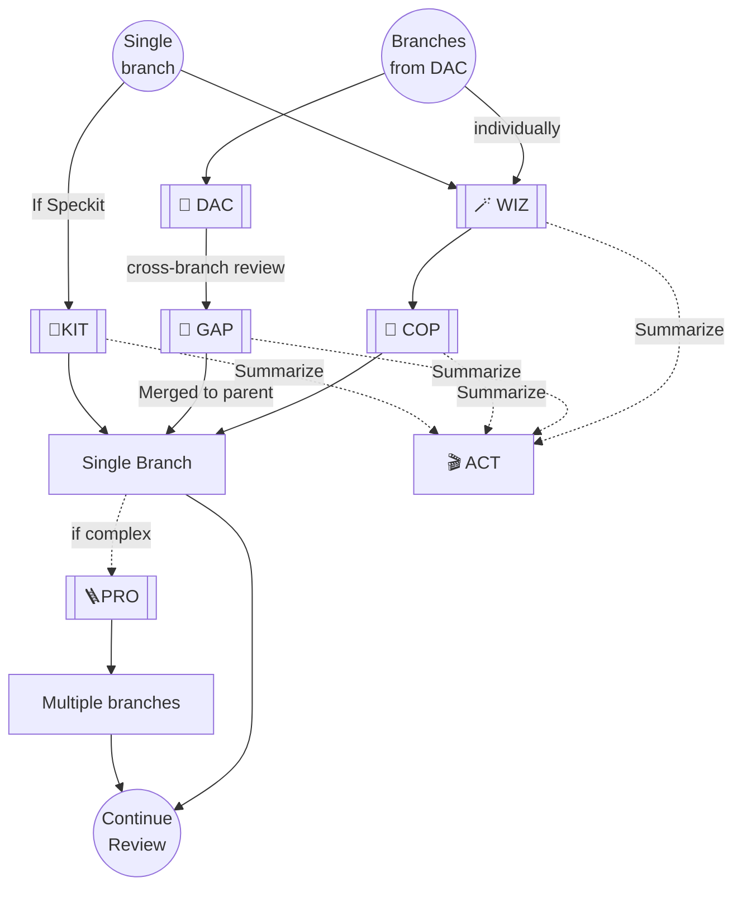
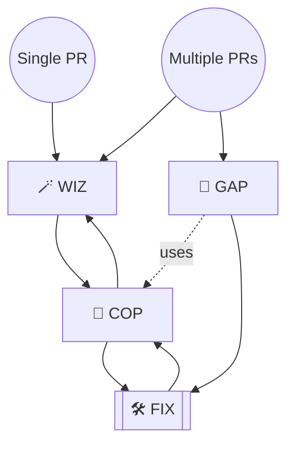
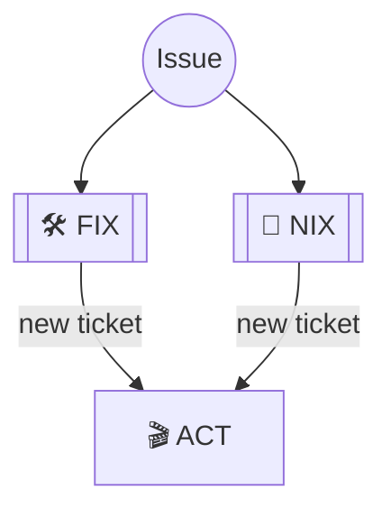
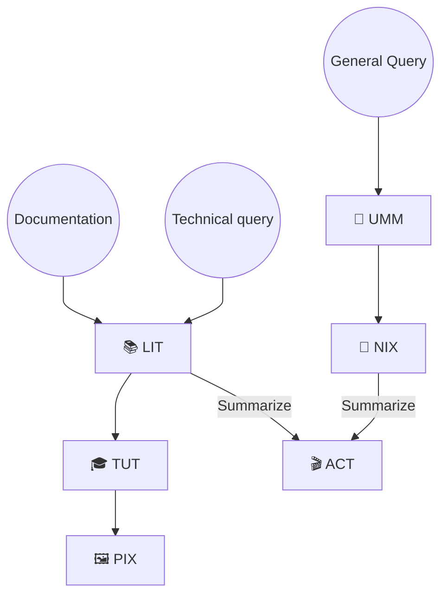

# ai-nix skill orientation

Choose by the outcome you need, not by the skill name. Start with **UMM** when the route is unclear; most workflows are read-only until you explicitly approve a change.

## Quick routes

- `UMM → NIX → ACT`: route an unclear request, understand it, then produce a useful brief, ticket, or handoff.
- `FIX → ACT`: diagnose an unexplained symptom before deciding what to change.
- `WIZ → COP`: assess a concrete PR, branch, or ticket, then apply an independent check. Add **GAP** for a recorded DAC or Pro hierarchy.
- `DAC → WIZ/GAP → ACT`: coordinate large Jira-backed delivery; use **DAC Help** when allocation is unclear.
- `LIT → PIX` explains and presents source material; choose **TUT** for a hands-on walkthrough. `KIT → MAP` recovers and resumes interrupted work.

Use `VAL` for test strategy, `PRO` to split and track an oversized PR through a feature-master, and `MEM` to find notes. Use `MAP → PRO` to resume a recorded reconstruction, then `GAP` for an independent hierarchy review. **DORA** is separate: use it for persistent codebase discovery and tracing, not as a delivery pipeline.

## Start-point routing flowchart

## New work

Use this route to turn a new Epic, large story, or bounded story into work that can enter the WIP flow.

## Work in progress

Use this route when implementation is already under way.

## Review

Use this route once the question is whether the change is ready, not how to build it.

## Bug / Issue

Use this route for investigating behavior

## Information

Use this route for questions that do not begin with new work, implementation in progress, or review.

