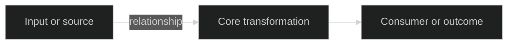

<!-- Template note: symbols in this template are examples drawn from references/visual-language.md.
     Always read visual-language.md before generating output and use its current symbol assignments.
     If visual-language.md has been updated since this template was last edited, its symbols take precedence. -->

# NIX analysis: [subject]

> **Purpose/question:** [What this analysis answers and enables]
>
> **Audience/use:** [Who needs this understanding and why]
>
> **Scope:** [Included workspace, paths, artifacts, or topic]
>
> **Evidence boundary:** [Local/external sources, freshness, and exclusions]
>
> **Status/freshness:** [Draft or complete, date, and evidence cutoff]
>
> **Material limitations:** [Constraints that affect the whole document]
>
> **Depth:** [Standard or Deep]

## 💭 Orientation

[Lead with the central explanation, why it matters, the dominant mental model, and the most useful next step.]

### Observations

| Dimension            | Current understanding | Evidence/confidence |
| -------------------- | --------------------- | ------------------- |
| Purpose              |                       |                     |
| Structure            |                       |                     |
| Key relationship     |                       |                     |
| Material uncertainty |                       |                     |
| Best next step       |                       |                     |

### Table of Contents

[Include this section when the document has more than three substantial sections; otherwise remove it.]

| Area   | Why it matters                    | Link   |
| ------ | --------------------------------- | ------ |
| [Area] | [Decision or comprehension value] | [link] |

### 📌 Foundations

- **Trigger:** [What prompted the analysis]
- **Core question:** [Underlying question, not merely symptoms]
- **In scope:** [Boundaries]
- **Out of scope:** [Exclusions]
- **Constraints:** [Technical, business, time, evidence, or access constraints]
- **Assumptions:** [Material bounded assumptions]
- **Exit condition:** [What sufficient understanding means for this run]

## 🧭 Explore - evidence landscape

### 🔎 Authoritative sources and entry points

| Source or entry point | Role | What it establishes | Limitation |
| --------------------- | ---- | ------------------- | ---------- |

### 🔎 Patterns, tools, and gaps

- **Existing patterns:** [Relevant conventions or precedents]
- **Available tools:** [Discovery, validation, build, or operational capabilities]
- **Conflicts/gaps:** [Missing or inconsistent evidence]
- **Diminishing-return boundary:** [Why further exploration is or is not needed]

## 🔗 Connect - relationships and evidence

[Explain hierarchy, ownership, dependencies, flows, state changes, sources of truth, consumers, and failure propagation.]

[Interpret the visual in prose. Remove it if the relationship is clearer without a diagram.]

### ⚠️ Impact and concerns

- **Direct dependencies:** [What the subject relies on]
- **Reverse dependencies:** [What relies on the subject]
- **Integration points:** [Interfaces, handoffs, or boundaries]
- **Failure modes:** [How problems propagate]

## 💡 Imagine - detailed analysis

| Interpretation, option, or counterfactual | Evidence and rationale | Benefits | Tradeoffs/unknowns |
| ----------------------------------------- | ---------------------- | -------- | ------------------ |

**Best-supported path or implication:** [Conclusion and what could change it]

## 🚧 Produce - findings and decisions

[Provide the durable mental model, key conclusions, terminology, findings, and recommendation when one is justified.]

### 🟰 Material findings

| Finding | Evidence class | Why it matters | Confidence/limitation |
| ------- | -------------- | -------------- | --------------------- |

### 🎬 Open decisions

| Decision | Why needed | Owner/input | Success criterion |
| -------- | ---------- | ----------- | ----------------- |

### 📋  Validation

[Include this section when executed or proposed checks materially affect the conclusion; otherwise remove it.]

| Result                                                   | Check                  | Purpose                      | Evidence or limitation          |
| -------------------------------------------------------- | ---------------------- | ---------------------------- | ------------------------------- |
| [Passed, failed, partial, blocked, proposed, or not run] | [Command or procedure] | [Question, finding, or risk] | [Observed result or limitation] |

## 🎁 Empower - next steps

1. **[Next reading, decision, check, or action]**
   - Purpose: [What it establishes]
   - Target: [File, component, question, or source]
   - Expected evidence: [What to look for]
   - Stop when: [Checkpoint]

## 📚 Evidence index

| ID   | Source                                           | Role                  | Evidence class or limitation                   |
| ---- | ------------------------------------------------ | --------------------- | ---------------------------------------------- |
| E001 | [Precise path, symbol, heading, output, or link] | [What it establishes] | [Observed, claimed, freshness, or scope limit] |
