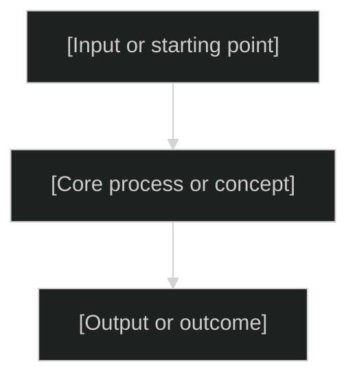

<!-- Template note: symbols in this template are examples drawn from references/visual-language.md.
     Always read visual-language.md before generating output and use its current symbol assignments.
     If visual-language.md has been updated since this template was last edited, its symbols take precedence. -->

---
marp: true
theme: default
paginate: true
header: "[Short title]"
footer: "Source: [source document name]"
---

# [Presentation title]

[Subtitle or one-line purpose]

**Audience:** [Who this is for]
**Date:** [Date]

<!-- Speaker notes:
Source document: [full path]
Depth: [Short | Standard | Extended]
Scope: [What the slideshow covers]
-->

---

## Why this matters

[1-3 sentences establishing context and motivation. State the problem, question, or opportunity that makes this subject worth the audience's time.]

<!-- Speaker notes:
Source: [section in source document]
Transition: Next we'll establish the key concepts needed to understand the rest.
-->

---

## The mental model

[Introduce the dominant concept, architecture, or framework. Use a diagram when the relationship is clearer visually.]



[1-2 lines interpreting the diagram.]

<!-- Speaker notes:
Source: [section in source document]
Transition: With this model in mind, let's look at the details.
-->

---

<!-- _class: lead -->

# [Section title]

[One-line context for what this section covers]

---

## [Key concept or finding]

- [Point 1 — the most important fact]
- [Point 2 — supporting detail]
- [Point 3 — implication or consequence]

<!-- Speaker notes:
Source: [section in source document]
Transition: [How this connects to the next slide]
-->

---

## [Comparison or decision]

| [Criterion] | [Option A] | [Option B] |
| --- | --- | --- |
| [Dimension 1] | [Value] | [Value] |
| [Dimension 2] | [Value] | [Value] |
| [Dimension 3] | [Value] | [Value] |

[1 line stating the implication of this comparison.]

<!-- Speaker notes:
Source: [section in source document]
Transition: [How this connects to the next slide]
-->

---

## [Code or configuration example]

```[language]
// [Essential code showing the pattern]
[code here — 15 lines maximum]
```

[1-2 lines explaining what to notice in this code.]

<!-- Speaker notes:
Source: [section in source document]
Transition: [How this connects to the next slide]
-->

---

## Key takeaways

- [Takeaway 1 — the most important conclusion]
- [Takeaway 2 — the most important relationship or pattern]
- [Takeaway 3 — the most important risk, caveat, or open question]

<!-- Speaker notes:
Recap the three things the audience should remember from this presentation.
-->

---

## Next steps

1. **[First action]** — [what it achieves and when to do it]
2. **[Second action]** — [what it achieves and when to do it]
3. **[Third action]** — [what it achieves and when to do it]

[One sentence on where to find more detail: the source document path or related resources.]

<!-- Speaker notes:
Source: [section in source document]
Close with the most important single action the audience should take away.
-->
