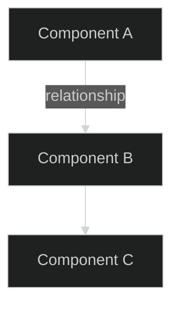

<!-- Template note: symbols in this template are examples drawn from references/visual-language.md.
     Always read visual-language.md before generating output and use its current symbol assignments.
     If visual-language.md has been updated since this template was last edited, its symbols take precedence. -->

# Tutorial: [topic]

> **Outcome:** [What the reader will be able to do after completing this tutorial]
>
> **Audience:** [Who this is for and assumed prior knowledge]
>
> **Prerequisites:** [Tools, access, versions, and environment needed]
>
> **Scope:** [What is covered and what is not]
>
> **Estimated time:** [How long the tutorial takes to complete]
>
> **Status/freshness:** [Draft or complete, date, version targeting]
>
> **Depth:** [Standard or Comprehensive]

## 💭 What you will learn

[Lead with the end result. Describe what the reader will build, configure, or accomplish. Explain when this task is useful and why it matters.]

### Overview


[Interpret the diagram: describe the high-level workflow the reader will follow.]

### Steps at a glance

| Step | What you will do                  | Checkpoint                |
| ---: | --------------------------------- | ------------------------- |
|    1 | [Action summary]                  | [How to verify]           |
|    2 | [Action summary]                  | [How to verify]           |
|    3 | [Action summary]                  | [How to verify]           |

## 🧭 Prerequisites

### Required tools

| Tool       | Minimum version | Install / verify command     |
| ---------- | --------------- | ---------------------------- |
| [Tool]     | [Version]       | `[command --version]`        |

### Required access

- [Credentials, permissions, or accounts needed]

### Environment setup verification

Run these checks before starting:

```bash
# Verify all prerequisites are met
[verification commands]
```

Expected output:

```
[expected output confirming readiness]
```

## 🔗 Architecture / context

[When the tutorial involves multiple components, include a diagram showing how they relate. Remove this section if the tutorial is single-component.]



[Interpret the diagram in prose.]

## 💡 Step-by-step instructions

### Step 1: [Action-oriented title]

**Purpose:** [What this step achieves and why]

[Action instructions and explanation]

```bash
[exact command or configuration]
```

[Explain non-obvious parameters or choices when needed]

**Verification checkpoint:**

```bash
[command to verify success]
```

Expected result:

```
[expected output]
```

If this fails, [brief corrective guidance or pointer to Troubleshooting].

---

### Step 2: [Action-oriented title]

**Purpose:** [What this step achieves and why]

[Continue the pattern for each step]

## 🟰 Variations and alternatives

[Include when meaningful alternatives exist for one or more steps. Remove if there are no significant alternatives.]

| Approach         | When to use                | Tradeoff                  |
| ---------------- | -------------------------- | ------------------------- |
| [Alternative]    | [Condition]                | [What you gain / lose]    |

## 🛠️ Troubleshooting

[Include for Comprehensive depth. For Standard depth, include inline notes at checkpoints instead and remove this section.]

| Symptom                          | Likely cause           | Resolution                        |
| -------------------------------- | ---------------------- | --------------------------------- |
| [Error message or observed state] | [Root cause]          | [Fix with exact commands]         |

## 🎁 What to do next

1. **[Next task, tutorial, or exploration]**
   - Purpose: [What it builds on from this tutorial]
   - Target: [Where to go]
   - Stop when: [What success looks like]

## 📚 References

| ID   | Source                              | Role                    | Limitation         |
| ---- | ----------------------------------- | ----------------------- | ------------------ |
| R001 | [Link or path]                      | [What it establishes]   | [Version, date]    |
