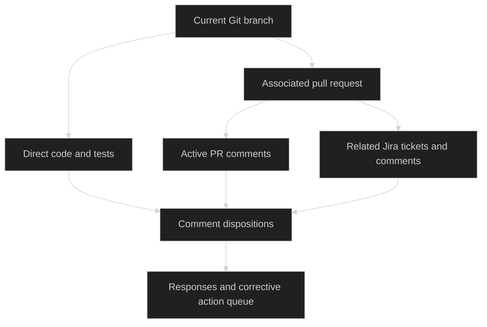

# VET Branch Readiness Review

> **Quick help:** If invoked with `?` as the only parameter, explain the branch-first review, its durable artifacts, and its explicit action-launch gate. Do not begin a review.

VET critically checks whether the work on the current Git branch addresses requirements and the active review conversation. It produces a resumable evidence record, a disposition and response for every active comment, and a dependency-ordered action queue. It begins with a compact overview, then resolves consequential details interactively.



The branch and direct checkout are the source of truth for work in progress. Tickets, PR text, and comments supply intent and review context; they do not prove implementation. Codebase-memory-mcp can map related systems outside the checkout, but it can be stale or omit WIP. Verify every material graph-derived claim against a matching current checkout or other direct evidence.

## `new` fresh-run override

When `new` is a standalone invocation keyword (for example, `/vet new`), start a fresh review. Do not inspect, resume, or reuse a prior VET run. After resolving the exact output folder this run would otherwise write, archive an existing same-run folder in its parent with the first unused suffix: `-a` through `-z`, then `-aa` onward. Never overwrite, merge, or archive unrelated folders.

The archive move needs the same local-write approval as creating output. Report both paths. This override grants no authority to edit source, run tests, mutate Git, or modify remote PRs, Jira issues, or comments.

## Output and authority

Resolve `TOOLING_OUTPUT_PATH` before locating durable output:

- An absolute value is the output base.
- A value beginning `./` or `.\\` is relative to the primary repository root.
- Reject every other relative form.
- When unset, use `<primary-repository-root>/.data`.
- Do not append another `.data` segment.

Default to read-only evidence gathering and planning. Creating a durable VET instance requires local-write approval. An action is not authorized merely because it appears in the queue:

- Applying an `A-###` code, test, Git, or local-workflow action requires the user's explicit authorization of that action.
- Posting a recommended `R-###` response, resolving a PR thread, editing a Jira issue, or changing remote state requires explicit authorization of that named remote action.
- Before an authorized action, refresh the exact branch HEAD and relevant remote comment or ticket state. Record the result. Never duplicate an already-posted response.

## Load guidance before judging

At the start of every review:

1. Read every Markdown file directly under this skill's `references/` directory.
2. Read every Markdown file directly under the installed sibling `../cop/references/` directory. COP's skeptical-review criteria and prefactoring guidance apply to VET findings.
3. Read repository-local `AGENTS.md`, `CLAUDE.md`/`claude.md`, contributing, ownership, and directory-specific instructions for every directly inspected repository and affected path.
4. Resolve the current versions of `ROOT_FE` and `ROOT_BE`; if either is usable and materially related, read its repository guidance before using it.
5. Follow conflicts in this order: the user's current instructions, applicable repository/organizational instructions, approved ticket contract, then VET/COP guidance. State material conflicts rather than silently choosing.

When available, `/ama` may be used for deeper architectural understanding after initial direct evidence has exposed a substantive uncertainty. Treat its output as a lead, not proof; return to direct code, tests, contracts, or authoritative integration evidence before making a material finding. Do not block VET if `/ama` is unavailable.

## Begin or resume

For Standard or Deep work, look for VET instances only in the resolved output base.

- Match an instance by primary repository identity, branch name, and recorded PR identity when known. A branch name alone is not sufficient if repositories differ.
- If exactly one matching instance exists, read `00-control.md` first; present the overview and ask whether to resume it or start a fresh review.
- On resume, recheck branch HEAD, worktree status, comparison basis, PR state, ticket update times, and active-comment fingerprints. Retain stable IDs for unchanged sources. Mark a changed, removed, resolved, or newly active comment in the register; never silently overwrite a prior disposition.
- Continue from `next safe action`, skip completed evidence gathering, and create new IDs only for genuinely new evidence, comments, findings, responses, or actions.
- If several instances could match, show concise candidates and ask which to resume. If none match, start a new one.

A Quick review stays in chat unless the user asks to save it. Standard and Deep work create a VET instance before substantial investigation.

## Resolve the branch and review scope

VET is invoked from a Git branch. Do not switch branches, stash, rebase, fetch, or change the working tree to make a review possible.

1. Resolve the primary repository root, current branch, HEAD, status, upstream, default branch where available, and merge-base comparison. Keep committed, staged, unstaged, and untracked changes distinct.
2. Establish a comparison base from explicit PR metadata, recorded integration context, or direct repository evidence. Do not infer `main`. If no credible base exists, review the current snapshot and label the diff basis **Unknown**.
3. Locate a PR for the exact source branch with the available host connector. If present, inspect title, description, target/source refs, diff, commits, checks, review threads, unresolved or active comments, and linked work items. If lookup is unavailable or inconclusive, record **Unknown** rather than assuming there is no PR.
4. Identify related Jira issues only from explicit PR links, branch/commit keys, or clear repository evidence. Do not choose among ambiguous keys. Use the available Jira integration to read each issue's summary, description, acceptance criteria, status, links, and current comments. Follow an issue link only when it constrains correctness, compatibility, validation, rollout, or scope.
5. Write a concise scope contract: intended outcome, explicit requirements and non-goals, exact branch/base and included change states, affected surfaces, and evidence limitations.

If a unique branch or safe comparison boundary cannot be established, present what is known in the overview and ask the smallest consequential question. Do not manufacture scope from nearby repository activity.

## Establish the code and repository boundary

The active checkout is the primary WIP authority:

| Evidence source | Role | Limitation |
| --- | --- | --- |
| Current branch checkout | WIP implementation, tests, configuration, and Git state | May omit complementary repositories. |
| PR and Jira integration | Intent, review conversation, remote state | Narrative or remote state does not prove code behavior. |
| `ROOT_FE` / `ROOT_BE` repositories | Complementary frontend/backend source and local WIP | Must be resolved and inspected; do not assume matching branch or schema. |
| Codebase-memory-mcp | Cross-project topology, callers, consumers, and impact leads | Index can be stale and may not contain WIP. |

For `ROOT_FE` and `ROOT_BE`:

- Read the variable value, verify the path exists, resolve its Git root and status, and record branch/HEAD. Do not assume the named location is current or contains the feature.
- Inspect a complementary repository only when the ticket, PR, diff, shared contract, or direct mapping provides evidence it is relevant. A matching branch name is a lead, not proof of inclusion.
- Search for real routes, symbols, schema migrations, contracts, configuration, and tests. Never infer tables, columns, API fields, transport, authorization, or persistence from names or similar code.
- Prefer codebase-memory-mcp for symbol, caller, data-flow, dependency, and cross-project discovery. Call `list_projects` first; index a relevant unindexed repository only with approval. Verify material graph claims directly in the relevant checkout, especially when evaluating WIP.
- Use text search for string literals, configuration, documentation, migrations, and graph gaps.

Read complete files before making a finding about them. For a claimed missing type, contract, or schema object, first check the credible base and directly relevant complementary repository or recorded dependency. If verification is impossible, state **Not verified** or **Blocked pending evidence**, not "missing."

## Review requirements and implementation

Build a requirement register from the related tickets, explicit PR contract, and observed branch intent. For every requirement, record **met**, **partly met**, **not met**, or **not verifiable**, with evidence and an action or question.

Apply relevant COP passes to every material concern:

1. Requirement alignment and scope control.
2. Assumption audit; reject invented structure, schema, contract, configuration, or behavior.
3. Schema and contract verification against real source.
4. Simplicity and pattern fit; challenge needless abstraction, refactoring, or deviation.
5. Failure, security, data-integrity, compatibility, idempotency, rollback, and operational analysis.
6. Implementation reality: trace entry points to observable outcomes, callers, consumers, and tests.
7. Alternative analysis when a comment or change has a meaningful tradeoff.

Respect established patterns unless observed evidence gives a valid reason to deviate. State that reason, its compatibility effects, and how it is validated. Record evidence-supported strengths with the same precision used for concerns.

## Critically review every active comment

Construct a comment register for every active PR review thread/comment and every current related-ticket comment that materially requests a change, raises a concern, decides scope, or affects acceptance. Include administrative or duplicate remarks only when they affect the required response; otherwise list them as reviewed out of scope with the reason.

For each `C-###`, record:

- Stable remote source ID, source system, author, timestamp/update time, link, and code location or ticket context.
- A concise, faithful summary; do not turn a suggestion into a requirement.
- Critical assessment against code, requirements, observed patterns, and COP guidance.
- One explicit disposition: **accept**, **partly accept**, **clarify**, **decline**, **superseded**, or **not verifiable**.
- Evidence IDs, finding IDs, a response draft `R-###`, and an action `A-###` where change is warranted.

A response draft is required even when declining a comment:

- **Accept / partly accept:** say what will change and link the planned action and validation.
- **Clarify:** state the exact unresolved decision and why evidence does not decide it.
- **Decline:** acknowledge the concern and cite the observed requirement, contract, or pattern that justifies not changing.
- **Superseded:** identify the newer decision, implementation, or comment that replaces it.
- **Not verifiable:** state missing evidence and the smallest check that resolves it.

Never claim a comment is addressed merely because a related change exists. Do not post or resolve anything until expressly authorized.

## Create and maintain durable artifacts

Initialize with:

```text
python <skill-directory>/scripts/init_instance.py --workspace <repository-root> --branch "<branch>" --head "<commit>" --base "<base-or-unknown>" --depth <quick|standard|deep> [--context-suffix "<context>"]
```

Immediately before creating a Standard or Deep folder, ask for the optional context suffix. The collision-safe folder is `<output-base>/vet-YY-MM-DD-<suffix>[-<context>]`. Maintain:

- `00-control.md`: identity, branch/PR/ticket fingerprints, scope, progress, assumptions, questions, action state, and next safe action.
- `01-evidence.md`: sources, repository boundaries, source freshness, direct-vs-graph classification, and limitations.
- `02-review.md`: requirement coverage, comment register, critical analysis, findings, and validation.
- `03-action-queue.md`: dependency-ordered corrective/restorative actions and response-publication tasks.
- `Findings.md`: reader-facing overview, decisions, response drafts, and action plan.

Checkpoint `00-control.md` after each material evidence, comment-disposition, or action-planning pass and before stopping. Use remote IDs plus updated timestamps/content fingerprints in its snapshot table. Before writing a new task or response, search the persisted register for that source and reuse its existing ID. Preserve completed and superseded items with their history; do not delete them to make a resume look fresh.

## Interact from overview to detail

Start each interaction with a compact overview containing target, evidence boundary, requirement and comment coverage counts, overall readiness, top one to three risks or strengths, and the most useful next decision. Use a small relationship diagram when cross-repository, ticket, PR, or action dependencies materially clarify the overview.

Then resolve detail in the smallest useful batch:

1. Address a blocking or high-impact evidence gap first.
2. Present the relevant `C-###`, `F-###`, `R-###`, and `A-###` chain with evidence and recommendation.
3. Ask for a decision only when code and governing guidance cannot resolve it, or when explicit authorization is needed.
4. Persist the decision and continue to the next dependency-ready item without redoing settled work.

Separate **recommended changes**, **recommended responses**, and **clarification/investigation** items. Do not hide uncertainty in a large summary.

## Validate, hand off, and launch actions

Before reporting a review complete:

1. Read `references/output-contract.md`, `references/visual-language.md`, and adapt `assets/findings-template.md`. The visual-language reference overrides template symbols.
2. Reconcile every requirement and every active comment against the registers.
3. Verify every material assertion has a source and separate direct code evidence from claimed, inferred, graph-derived, or unknown material.
4. State checks as **passed**, **failed**, **blocked**, **not run**, or **proposed** only when their actual status is observed.
5. Apply the output-contract quality gate.

For an authorized `A-###` or `R-###` launch, re-read its scope, refresh the relevant source snapshot, perform only the named action, and record exact results, validation, and remote IDs when applicable. If a source changed materially, mark the queued item stale and return to the overview rather than applying an obsolete recommendation.

The handoff reports readiness verdict, scope and evidence limits, requirement coverage, comment coverage, recommendations, response drafts, and next safe action. Keep remote publication and source changes distinct from review completion.
