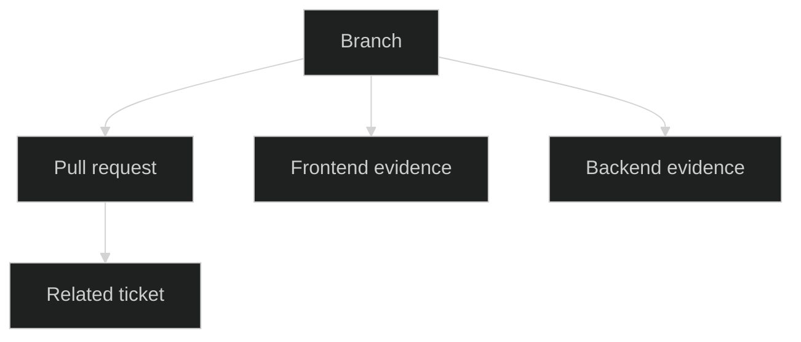

<!-- Symbols are examples. Read references/visual-language.md before producing output; it overrides this template. -->

# Branch vetting review: [branch]

> **Purpose:** [Readiness question and desired outcome]
>
> **Review target:** [repository, branch, HEAD, base, worktree state]
>
> **Related context:** [PR identity/state; Jira issue keys; snapshot times]
>
> **Repositories:** [primary, ROOT_FE/ROOT_BE availability and boundary]
>
> **Evidence boundary:** [direct checkout, remote, graph, inaccessible sources]
>
> **Overall readiness:** [Ready | Ready with actions | Not ready | Unable to verify]

## 💭 Overview

[One concise assessment, the dominant risk or strength, and the next decision to resolve interactively.]

| Dimension | Status | Evidence |
| --- | --- | --- |
| Requirements | [Met/partial/unverified] | [E-###] |
| Active comments | [count and coverage] | [C-### range] |
| Corrective work | [count/status] | [A-###] |
| Recommended responses | [count/status] | [R-###] |
| Best next step | [specific selection] | [reason] |

## 🧭 Scope and requirement coverage

| Requirement | Coverage | Evidence | Gap or action |
| --- | --- | --- | --- |
| [REQ-01] | [Met/partial/not met/unverified] | [E-###] | [A-### or question] |

## 🔗 Evidence and relationships

### Observed topology

[Replace or omit. Explain each observed edge and its evidence.]

### Strengths

- **G-01:** [Observed strength and why it matters.]

### Evidence gaps

- **E-###:** [Missing, stale, or inaccessible material and impact.]

## 💡 Active comment dispositions

| ID | Source/location | Comment | Critical assessment | Disposition | Recommended response | Action | Evidence |
| --- | --- | --- | --- | --- | --- | --- | --- |
| C-01 | [PR/Jira; ID; file:line] | [Concise request] | [Merit, scope, correctness] | [accept/etc.] | R-01 | A-01/None | E-### |

### Recommended responses

- **R-01 -> C-01:** [Draft response. State facts, decision, and action or precise question.]

## 🟰 Findings and decisions

| ID | Finding | Seriousness | Confidence | Evidence | Recommendation |
| --- | --- | --- | --- | --- | --- |
| F-01 | [Concise concern or decision] | [Level] | [Level] | E-### | A-###/R-### |

## 📋 Validation

| Status | Check | Purpose | Evidence or limitation |
| --- | --- | --- | --- |
| [Passed/failed/blocked/not run/proposed] | [Check] | [Risk addressed] | [Observed output or limit] |

## 🎬 Action queue

| ID | Status | Type | Recommendation | Scope | Depends on | Validation | Stop when |
| --- | --- | --- | --- | --- | --- | --- | --- |
| A-01 | ⚪ Not started | [corrective/restorative/response] | [Smallest change] | [files/symbols/remote target] | [IDs] | [check] | [objective evidence] |

### Launch options

- [ ] Apply selected corrective/restorative action IDs after explicit authorization.
- [ ] Publish selected response IDs after explicit authorization and a freshness recheck.
- [ ] Investigate the listed unknown before selecting an action.

## 📚 Evidence index

| ID | Source | What it establishes | Class/freshness |
| --- | --- | --- | --- |
| E-001 | [path:line, PR URL, Jira key, graph result] | [Fact] | [Observed/Claimed/etc.] |
